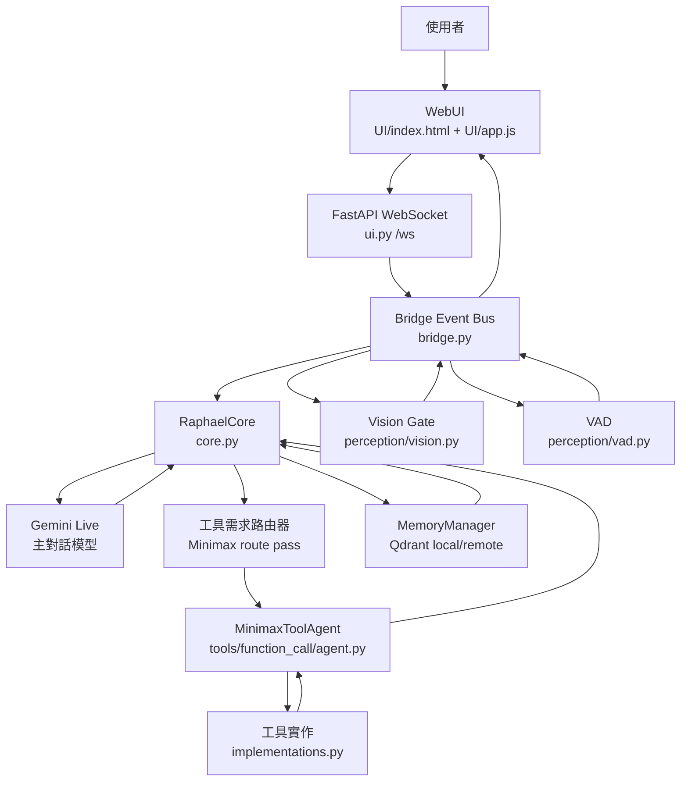

# OmniCore Raphael

Raphael 是一個以 Gemini Live 作為主對話大腦、搭配本地 WebUI、長期記憶、環境感知與 Minimax 工具代理的「環境感知型個人 AI 助理」。它的目標不是只做一般聊天，而是把文字、語音、畫面、記憶、網站操作、檔案操作與桌面工具整合在同一個即時互動介面中。

這份 README 是專案的完整操作與開發手冊。它適合三種人閱讀：

- 想把 Raphael 跑起來的人。
- 想理解它內部架構與資料流的人。
- 想繼續改進工具能力、記憶能力、主動開口與 WebUI 的人。

> 注意：本專案會讀取 `.env`、`credentials.json`、`token.json`、本地記憶資料庫與瀏覽器 profile。請不要把個人金鑰、OAuth token、帳號密碼或瀏覽器資料提交到公開 repo。

---

## 目錄

- [核心能力](#核心能力)
- [專案結構](#專案結構)
- [系統架構](#系統架構)
- [快速啟動](#快速啟動)
- [依賴安裝](#依賴安裝)
- [環境變數](#環境變數)
- [WebUI 使用方式](#webui-使用方式)
- [啟動模式](#啟動模式)
- [資料流與頻道](#資料流與頻道)
- [Gemini 主腦](#gemini-主腦)
- [Minimax 工具代理](#minimax-工具代理)
- [工具需求路由器](#工具需求路由器)
- [任務語音回報](#任務語音回報)
- [背景瀏覽器與桌面操作](#背景瀏覽器與桌面操作)
- [長期記憶系統](#長期記憶系統)
- [身份記憶](#身份記憶)
- [感知系統](#感知系統)
- [檔案上傳與輸出](#檔案上傳與輸出)
- [測試與驗證](#測試與驗證)
- [常見問題](#常見問題)
- [開發指南](#開發指南)
- [安全與隱私](#安全與隱私)
- [維護清單](#維護清單)

---

## 核心能力

Raphael 目前整合了以下能力：

### 1. Gemini Live 即時對話

- 使用 Gemini Live WebSocket。
- 支援文字輸入。
- 支援瀏覽器麥克風音訊輸入。
- 支援瀏覽器鏡頭影像輸入。
- 支援 Gemini 文字轉錄與音訊輸出。
- 可透過 WebUI 切換 voice、thinking level、回應模式。

### 2. WebUI 控制中心

- 入口：`http://localhost:8765`
- 靜態前端：`UI/index.html`、`UI/app.js`
- WebSocket：`/ws`
- 可控制來源：
  - 文字
  - 麥克風
  - 鏡頭
  - 工具
  - 記憶
  - 主動開口
- 可控制功能：
  - Vision Gate
  - 視覺 overlay
  - 視覺主動開口
  - 圖像身份記憶
  - 聲紋身份記憶
  - 嘴型同步輔助
  - 智慧語音閘門
  - 電腦操作工具
  - 任務語音回報
  - Minimax 工具代理設定

### 3. 長期記憶

- 使用 `MemoryManager` 管理。
- 預設使用本機 Qdrant local storage。
- 支援多記憶帳號。
- 支援記憶分類：
  - personal
  - preference
  - technical
  - project
  - event
  - credential
  - other
- 支援文字記憶、圖像身份記憶、聲紋身份記憶。

### 4. 工具代理

Raphael 本身是主對話模型。需要外部工具時，會委派給 Minimax 工具代理。

工具代理可用能力包括：

- 網路搜尋
- 圖片搜尋與下載
- 網站入口搜尋與記憶
- 背景瀏覽器操作
- 網站登入
- Gmail / Google API
- Calendar / Drive / Sheets 類工作
- 檔案讀寫
- PDF / DOCX / XLSX / CSV / SQLite
- git 查詢
- shell / PowerShell
- 桌面截圖、視窗切換、鍵盤滑鼠操作
- 天氣、新聞、匯率、Wikipedia
- 通知與 webhook
- JSON / CSV / SQLite 資料處理

### 5. 工具需求路由器

使用者輸入進 Gemini 前，會先經過一個小型工具需求路由器。它會判斷這輪是否能直接回答，或是否必須先取得工具證據。

如果請求需要目前狀態、外部資料、畫面、視窗、網站、檔案、郵件、日曆、雲端、登入、下載、查證或實際操作，就會先委派工具，再把工具結果交回 Gemini 回答。

這個設計是為了避免模型「沒有調用工具就直接猜」。

### 6. 環境感知與主動開口

- Vision Gate 分析畫面變化。
- VAD 分析使用者是否正在說話。
- 當畫面中有重要變化時，可把事件交給 Gemini 判斷是否要主動說一句話。
- 主動開口不直接固定回應，而是把事件、畫面與上下文交給 Gemini 決定是否 `SILENT`。

---

## 專案結構

主要檔案如下：

```text
OmniCore-Raphael/
├─ ui.py
├─ core.py
├─ bridge.py
├─ dependency_bootstrap.py
├─ requirements.txt
├─ README.md
├─ UI/
│  ├─ index.html
│  ├─ app.js
│  └─ raphael_ui_preview.html
├─ perception/
│  ├─ vision.py
│  ├─ vad.py
│  └─ __init__.py
├─ tools/
│  ├─ function_call/
│  │  ├─ agent.py
│  │  ├─ definitions.py
│  │  ├─ implementations.py
│  │  ├─ registry.py
│  │  └─ __init__.py
│  └─ memory/
│     ├─ manager.py
│     ├─ persona.py
│     ├─ store.py
│     ├─ local_store.py
│     ├─ visual_identity.py
│     ├─ voice_identity.py
│     └─ __init__.py
├─ data/
│  ├─ uploads/
│  ├─ outputs/
│  ├─ site_memory.json
│  └─ browser_profile/
├─ test-tool-agent-learning.py
├─ test-vision-feedback.py
├─ test-vad.py
├─ test-yolo-complete.py
├─ credentials.json
├─ token.json
└─ yolov8n.pt
```

### 檔案職責

| 檔案 | 職責 |
|---|---|
| `ui.py` | FastAPI 入口、WebSocket 橋接、靜態檔服務、啟動 core 與 perception |
| `core.py` | Gemini Live 連線、主對話控制、工具路由、記憶注入、主動開口 |
| `bridge.py` | 模組間事件匯流排，所有資料流都透過 Channel 發佈/訂閱 |
| `UI/index.html` | WebUI 畫面結構與設定面板 |
| `UI/app.js` | WebUI 狀態、WebSocket、音訊、鏡頭、工具卡片、設定同步 |
| `tools/memory/persona.py` | Raphael system prompt 與記憶工具宣告 |
| `tools/function_call/agent.py` | Minimax 工具代理、工具需求路由器、工具結果整理 |
| `tools/function_call/implementations.py` | 所有工具實作 |
| `tools/function_call/registry.py` | `@tool` 註冊器與工具 schema 生成 |
| `perception/vision.py` | CLIP 語義漂移、光流、Vision Gate、主動事件 |
| `perception/vad.py` | Silero VAD、麥克風語音活動偵測 |
| `dependency_bootstrap.py` | 內建依賴安裝與檢查工具 |

---

## 系統架構



### 高層流程

1. 使用者在 WebUI 輸入文字、語音或開啟鏡頭。
2. `ui.py` 把事件送進 `Bridge`。
3. `core.py` 訂閱文字、音訊、影像與主動事件。
4. 文字輸入會先：
   - 更新使用者活動狀態。
   - 查詢相關記憶。
   - 執行工具需求路由器。
   - 如有必要，先委派 Minimax 工具代理。
   - 把工具結果與記憶上下文一起送給 Gemini。
5. Gemini 回傳音訊與文字轉錄。
6. `core.py` 把回應發回 WebUI。
7. WebUI 顯示字幕、工具卡片、記憶卡片、感知狀態，並播放音訊。

---

## 快速啟動

### 1. 進入專案目錄

```powershell
cd "C:\Users\Alex\Downloads\OmniCore-Raphael (1)\OmniCore-Raphael"
```

### 2. 建立或啟用 Python 環境

建議使用 Python 3.11 或更新版本。

```powershell
python -m venv .venv
.\.venv\Scripts\Activate.ps1
```

如果 PowerShell 阻擋啟用腳本，可先執行：

```powershell
Set-ExecutionPolicy -Scope CurrentUser RemoteSigned
```

### 3. 安裝依賴

最簡單方式：

```powershell
python -m pip install -r requirements.txt
```

或使用內建依賴安裝器：

```powershell
python ui.py --install-deps all --with-torch
```

### 4. 設定 `.env`

專案根目錄需要 `.env`。最小可用設定如下：

```env
GEMINI_API_KEY=你的 Gemini API Key
NIM_API_KEY=你的 NVIDIA/Minimax OpenAI-compatible API Key
NIM_BASE_URL=https://integrate.api.nvidia.com/v1
NIM_MODEL=minimaxai/minimax-m2.7
```

### 5. 啟動 WebUI

```powershell
python ui.py
```

瀏覽器開啟：

```text
http://localhost:8765
```

### 6. 啟動含本機感知模式

```powershell
python ui.py --perception
```

`--perception` 會額外啟動本機 VAD 與本機 Vision 模組。即使不加 `--perception`，WebUI 仍可使用瀏覽器提供的麥克風與鏡頭。

---

## 依賴安裝

### 內建依賴 profile

`dependency_bootstrap.py` 支援多組 profile：

| Profile | 用途 |
|---|---|
| `core` | FastAPI、WebSocket、dotenv、certifi |
| `web` | core 的別名，用於純 Web 模式 |
| `memory` | Qdrant 記憶層 |
| `memory-semantic` | Qdrant + sentence-transformers + fastembed |
| `perception` | OpenCV、Pillow、ultralytics、CLIP、sounddevice |
| `identity` | 基礎圖像身份記憶 |
| `identity-strong` | insightface + onnxruntime 強化臉部辨識 |
| `tools` | Minimax 工具、Google API、Playwright、檔案處理、桌面操作 |
| `all` | core + perception + memory + identity + tools |

### 檢查依賴

```powershell
python ui.py --check-deps all
```

### 安裝依賴

```powershell
python ui.py --install-deps core
python ui.py --install-deps tools
python ui.py --install-deps memory
python ui.py --install-deps perception --with-torch
python ui.py --install-deps all --with-torch
```

### Playwright 瀏覽器

背景瀏覽器工具需要 Playwright browser runtime。安裝 Python 套件後，通常還需要：

```powershell
python -m playwright install
```

### Torch GPU / CPU

`requirements.txt` 內有提示：

CPU：

```powershell
pip install torch --index-url https://download.pytorch.org/whl/cpu
```

GPU：

```powershell
pip install torch --index-url https://download.pytorch.org/whl/cu128
```

---

## 環境變數

Raphael 主要透過 `.env` 設定。

### Gemini

| 變數 | 預設 | 說明 |
|---|---:|---|
| `GEMINI_API_KEY` | 無 | Gemini Live API key，必要 |
| `RAPHAEL_VOICE` | `Puck` | Gemini 語音 |
| `RAPHAEL_THINKING` | 空 | thinking level，可用 `minimal`、`low`、`medium`、`high` |
| `RAPHAEL_SSL_VERIFY` | `1` | 設為 `0` 可跳過 Gemini WebSocket TLS 驗證，不建議長期使用 |

### Minimax / NVIDIA OpenAI-compatible API

| 變數 | 預設 | 說明 |
|---|---:|---|
| `NIM_API_KEY` | 無 | Minimax 工具代理 API key，工具代理必要 |
| `NIM_BASE_URL` | `https://integrate.api.nvidia.com/v1` | OpenAI-compatible base URL |
| `NIM_MODEL` | `minimaxai/minimax-m2.7` | 工具代理模型 |
| `NIM_REQUEST_TIMEOUT` | `180` | 工具代理請求 timeout 秒數 |
| `NIM_TEMPERATURE` | `0.2` | 工具代理 temperature |
| `MAX_TOOL_ROUNDS` | `16` | Gemini 與工具代理共用的最大工具輪數概念 |

### 記憶系統

| 變數 | 預設 | 說明 |
|---|---:|---|
| `RAPHAEL_USER` | `wayne` | 預設記憶帳號 |
| `RAPHAEL_MEMORY_BACKEND` | `qdrant_local` | `qdrant_local` 或 `qdrant_remote` |
| `QDRANT_PATH` | `tools/memory/qdrant_data` | 本機 Qdrant 資料路徑 |
| `QDRANT_HOST` | `127.0.0.1` | 遠端 Qdrant host |
| `QDRANT_PORT` | `6333` | 遠端 Qdrant port |
| `RAPHAEL_EMBEDDING_BACKEND` | `hashing` | `hashing` 或 `sentence_transformers` |

### 身份與語音感知

| 變數 | 預設 | 說明 |
|---|---:|---|
| `RAPHAEL_IDENTITY_SCAN_FPS` | `3.0` | 圖像身份掃描頻率 |
| `RAPHAEL_IDENTITY_THRESHOLD` | `0.74` | 圖像身份匹配門檻 |
| `RAPHAEL_FACE_BACKEND` | `opencv` | 人臉 backend |
| `RAPHAEL_VOICE_SCAN_GAP` | `1.4` | 聲紋掃描間隔 |
| `RAPHAEL_VOICEPRINT_THRESHOLD` | `0.82` | 聲紋匹配門檻 |
| `RAPHAEL_MOUTH_SYNC_THRESHOLD` | `0.045` | 嘴型同步門檻 |

### 主動開口

| 變數 | 預設 | 說明 |
|---|---:|---|
| `RAPHAEL_PROACTIVE_MIN_GAP` | `2.5` | 主動開口最小間隔 |
| `RAPHAEL_PROACTIVE_REPEAT_GAP` | `4` | 重複事件間隔 |
| `RAPHAEL_PROACTIVE_AFTER_USER_GRACE` | `2` | 使用者說話後緩衝 |
| `RAPHAEL_PROACTIVE_AFTER_ASSISTANT_GRACE` | `1.5` | 助理說話後緩衝 |
| `RAPHAEL_PROACTIVE_AUDIO_CONTEXT_WINDOW` | `8` | 語音上下文視窗 |

### Google / Gmail / Calendar / Drive / Sheets

| 變數 | 預設 | 說明 |
|---|---:|---|
| `GOOGLE_CREDENTIALS_PATH` | `credentials.json` | Google OAuth client secrets |
| `GOOGLE_TOKEN_PATH` | `token.json` | Google OAuth token |

### 第三方工具

| 變數 | 用途 |
|---|---|
| `OPENWEATHER_API_KEY` | 天氣查詢 |
| `NEWS_API_KEY` | 新聞搜尋 |
| `GITHUB_PAT` | GitHub API |
| `DISCORD_WEBHOOK_URL` | Discord 通知 |
| `TELEGRAM_BOT_TOKEN` | Telegram bot |
| `TELEGRAM_CHAT_ID` | Telegram chat |
| `LINE_NOTIFY_TOKEN` | LINE Notify |
| `SLACK_WEBHOOK_URL` | Slack webhook |

---

## WebUI 使用方式

啟動後開啟：

```text
http://localhost:8765
```

### 左側 / 中央對話區

中央對話區顯示：

- 使用者訊息
- Raphael 回覆字幕
- 工具呼叫卡片
- 工具結果卡片
- 記憶寫入卡片
- 錯誤訊息
- 主動開口提示

### 右側狀態區

右側通常顯示：

- 工具呼叫歷史
- 記憶事件
- 感知事件
- 目前狀態

### 來源控制

WebUI 有來源控制：

| 來源 | 作用 |
|---|---|
| Vision | 允許鏡頭畫面送往後端與 Gemini |
| Audio | 允許瀏覽器麥克風音訊送往後端 |
| Tool | 允許工具委派 |
| Memory | 允許記憶搜尋與寫入 |

### 對話設定

常用設定：

- 主動開口
- 可被打斷
- 隱藏字幕
- 任務語音回報

### Demo 安全開關

這些開關適合 demo 時快速降低風險：

- Vision Gate
- 視覺 Overlay
- 視覺主動開口
- 圖像身份
- 聲紋身份
- 嘴型同步
- 智慧語音閘門
- 電腦操作工具

關閉 `電腦操作工具` 後，涉及 `computer_*` 的桌面點擊、打字、快捷鍵與截圖操作會被阻擋。

### Minimax 工具代理設定

WebUI 的系統設定中可調整：

- 模型名稱
- Base URL
- 最大工具輪數
- Request timeout
- Temperature

設定會送到後端 `session_config`，並由 `update_minimax_settings()` 套用到 runtime。

---

## 啟動模式

### 純 Web 模式

```powershell
python ui.py
```

特點：

- 使用 FastAPI 提供 WebUI。
- 使用瀏覽器的麥克風與鏡頭。
- 不啟動本機 `VadModule` 與 `VisionModule`。
- 仍會啟動 `BrowserVisionAnalyzer`，用來處理 Web 鏡頭的視覺分析。

### 本機感知模式

```powershell
python ui.py --perception
```

特點：

- 啟動本機 VAD。
- 啟動本機 Vision。
- 可直接從系統麥克風與攝影機取資料。
- 適合需要更完整本機感知 pipeline 的場景。

### 依賴檢查模式

```powershell
python ui.py --check-deps all
```

### 依賴安裝模式

```powershell
python ui.py --install-deps all --with-torch
```

---

## 資料流與頻道

所有模組透過 `Bridge` 溝通。`bridge.py` 中的 `Channel` 是後端與前端共同協議。

### 後端到前端頻道

| Channel | 說明 |
|---|---|
| `sensor_view` | 感知畫面、VAD、gate 狀態 |
| `vad_event` | VAD 即時音量 / speaking |
| `vision_event` | 視覺事件日誌 |
| `transcript_in` | 使用者語音輸入轉錄 |
| `transcript_out` | Raphael 回應字幕 |
| `tool_call` | 工具呼叫 |
| `tool_result` | 工具結果 |
| `task_voice` | 工具任務狀態語音 |
| `memory_write` | 記憶寫入 |
| `proactive` | 主動開口觸發原因 |
| `audio_out` | Gemini 音訊輸出 |
| `interrupted` | 回應被打斷 |
| `status` | 連線狀態 |
| `usage` | token / session 用量 |
| `memory_accounts` | 記憶帳號清單 |
| `error` | 錯誤 |

### 前端到後端頻道

| Channel | 說明 |
|---|---|
| `text_in` | 使用者文字 |
| `audio_in` | 瀏覽器麥克風 PCM |
| `video_in` | 瀏覽器鏡頭 JPEG |
| `file_upload` | 檔案上傳 |
| `session_config` | voice、thinking、memory user、features、Minimax 設定 |
| `source_control` | 來源開關 |
| `feature_control` | 功能開關 |
| `memory_account` | 記憶帳號新增、刪除、切換 |
| `ping` | WebSocket ping |

---

## Gemini 主腦

`core.py` 中的 `RaphaelCore` 負責 Gemini Live session。

主要工作：

- 建立 Gemini WebSocket。
- 傳送 setup：
  - model
  - voice
  - thinkingConfig
  - systemInstruction
  - tools
  - input / output transcription
- 接收 Gemini audio output。
- 接收 Gemini transcript。
- 處理 Gemini tool call。
- 轉發文字、音訊、影像給 Gemini。
- 組裝記憶上下文。
- 觸發工具預檢。
- 處理主動開口事件。

### System Prompt

Raphael 的主要 persona 在：

```text
tools/memory/persona.py
```

該 prompt 定義：

- Raphael 是環境感知助理。
- 能接收文字、音訊、畫面。
- 不可假裝看見、聽見或查到。
- 需要工具時使用 `delegate_tool_task`。
- 帳密記憶與登入規則。
- 工具結果必須被當作事實。
- 不可把使用者要求改成無關任務。
- 不可泛用拒絕已授權的無害任務。
- 記憶分類與品質規則。

---

## Minimax 工具代理

Minimax 工具代理位於：

```text
tools/function_call/agent.py
```

它的角色不是主對話，而是工具執行代理。

### 分工

| 模組 | 責任 |
|---|---|
| Gemini | 理解使用者、最終回答、記憶判斷 |
| Tool Router | 判斷是否需要先使用工具 |
| Minimax Tool Agent | 執行工具、回傳真實結果 |
| implementations.py | 實際工具函式 |

### 工具代理規則

工具代理 system prompt 強調：

- 需要工具就主動呼叫。
- 不要猜測或捏造。
- 嚴格貼合本輪任務。
- 不把舊記憶任務混進新任務。
- 登入任務優先使用背景瀏覽器。
- 桌面操作必須先確認視窗。
- 網站入口先查 `site_memory_search`。
- DNS / 404 / 錯站要寫入失敗記憶。
- 不可用 Gmail 代替 WebUI 傳檔。
- 圖片與檔案任務要回傳 file path / file_url。

### 工具結果契約

`core.py` 會把工具代理結果轉成 `assistant_response_contract`。這個契約告訴 Gemini：

- 哪些工具動作已成功完成。
- 哪些成功副作用是權威事實。
- 不可把已完成的事情改口說沒完成。
- 若任務未完成，必須說明已完成進度與下一步。

---

## 工具需求路由器

工具需求路由器位於：

```text
tools/function_call/agent.py
```

相關函式：

- `route_user_request_for_tools()`
- `normalize_tool_route_decision()`
- `tool_route_requires_delegate()`

### 為什麼需要它

只靠 Gemini 自己決定是否調用工具，會出現幾種問題：

- 使用者要求看目前畫面，模型卻直接猜。
- 使用者要求操作網站，模型卻只給建議。
- 工具其實完成了，模型卻說它不能做。
- 需要外部狀態的任務被當成一般聊天。

工具需求路由器的用途是把「能不能直接回答」這件事提前判斷。

### 判斷規則

只有以下任務可以 direct：

- 純聊天。
- 一般知識解釋。
- 創作。
- 改寫。
- 翻譯。
- 不依賴目前狀態的推理。

以下任務要 delegate：

- 目前狀態。
- 畫面、螢幕、視窗。
- 網站、登入、課程平台。
- 檔案、圖片、下載。
- 郵件、日曆、雲端。
- 系統、API、命令、桌面操作。
- 網路搜尋、最新資訊、查證。

### 預檢流程

1. `core.py` 收到使用者文字。
2. 先搜尋相關記憶。
3. 呼叫工具需求路由器。
4. 如果路由器回傳 `delegate`：
   - WebUI 顯示 `delegate_tool_task`。
   - 後端先執行工具代理。
   - 工具結果整理成內部上下文。
   - 再把原始使用者問題與工具證據一起送給 Gemini。
5. Gemini 根據工具證據回答。

---

## 任務語音回報

Raphael 不只在工作完成時說話，也會在任務生命週期中用短語音回報。

### 觸發時機

- 收到工具任務。
- 判斷需要先使用工具。
- 工具開始執行。
- 背景瀏覽器有進展。
- 檔案處理完成。
- 桌面操作有進展。
- 任務遇到問題。
- 工具任務完成。
- 工具輪數接近上限。

### 實作位置

| 檔案 | 說明 |
|---|---|
| `bridge.py` | `Channel.TASK_VOICE` |
| `core.py` | `_task_voice_line()`、`publish_task_voice()` |
| `UI/app.js` | `speakTaskVoice()` |
| `UI/index.html` | 「任務語音回報」開關 |

### 前端播放方式

任務語音回報使用瀏覽器內建：

```js
SpeechSynthesisUtterance
window.speechSynthesis.speak(...)
```

這與 Gemini audio output 是兩條不同通道。

---

## 背景瀏覽器與桌面操作

Raphael 有兩種操作環境：

### 背景瀏覽器

工具名前綴：

```text
browser_*
```

常用工具：

- `browser_open`
- `browser_get_page`
- `browser_links`
- `browser_follow_link`
- `browser_click`
- `browser_fill`
- `browser_press_key`
- `browser_wait`
- `browser_back`
- `browser_scroll`
- `browser_screenshot`
- `browser_login`
- `browser_close`

用途：

- 登入網站。
- 查看 Moodle / LMS / 後台。
- 操作不需要打擾使用者目前瀏覽器的網站。
- 讀取頁面文字、controls、links。
- 截圖回傳 WebUI。

背景瀏覽器使用 `data/browser_profile` 保存 profile。

### 桌面操作

工具名前綴：

```text
computer_*
```

常用工具：

- `computer_active_window`
- `computer_list_windows`
- `computer_focus_window`
- `computer_screenshot_window`
- `computer_screenshot`
- `computer_screen_size`
- `computer_mouse_position`
- `computer_click`
- `computer_double_click`
- `computer_move_mouse`
- `computer_drag_mouse`
- `computer_scroll`
- `computer_type_text`
- `computer_press_key`
- `computer_hotkey`
- `computer_locate_image`
- `computer_control`

### 視窗意識規則

桌面操作不是直接亂點。

`computer_control()` 要求如果要點擊、輸入、快捷鍵或拖曳，第一步必須是：

- `active_window`
- `list_windows`
- `focus_window`
- `screenshot_window`

這是為了確保 Raphael 知道自己正在操作哪個視窗。

### 背景瀏覽器優先原則

登入網站或操作網頁時，優先使用 `browser_*`。

只有在：

- 背景瀏覽器不可用。
- 網站必須使用前景視窗。
- 使用者明確要求操作目前桌面。

才使用 `computer_*`。

---

## 長期記憶系統

### 記憶管理器

位置：

```text
tools/memory/manager.py
```

功能：

- 建立記憶帳號。
- 切換記憶帳號。
- 刪除記憶帳號。
- 儲存文字記憶。
- 搜尋文字記憶。
- 管理圖像身份記憶。
- 管理聲紋身份記憶。

### 記憶帳號

WebUI 可切換記憶帳號。每個帳號有獨立的長期記憶脈絡。

帳號清單存放於：

```text
tools/memory/memory_accounts.json
```

### Qdrant local

預設使用：

```text
tools/memory/qdrant_data
```

若同時啟動兩個 Raphael，可能會遇到 Qdrant local lock。解法：

1. 關閉舊的 `python ui.py`。
2. 在工作管理員結束殘留 Python。
3. 或改用遠端 Qdrant：

```env
RAPHAEL_MEMORY_BACKEND=qdrant_remote
QDRANT_HOST=127.0.0.1
QDRANT_PORT=6333
```

### 記憶分類

| 類別 | 用途 |
|---|---|
| `personal` | 姓名、身份、聯絡方式、長期背景 |
| `preference` | 偏好、語氣、習慣、互動方式 |
| `technical` | 技術選型、環境、架構、設定、錯誤模式 |
| `project` | 專案目標、進度、需求、決策、缺陷、修復狀態 |
| `event` | 會議、期限、約定、待辦與時間相關事件 |
| `credential` | 使用者明確要求保存的低風險登入資料 |
| `other` | 重要但不屬於以上的資訊 |

### Credential 記憶規則

Credential 只有在使用者明確要求記住或用來登入時才寫入。

應包含：

- 服務名稱。
- 登入網址或識別詞。
- 帳號。
- 密碼。
- 使用限制。

自然語言回覆與 UI 摘要中會盡量遮蔽密碼。

---

## 身份記憶

### 圖像身份記憶

位置：

```text
tools/memory/visual_identity.py
```

用途：

- 使用者明確要求「記住這個人」時，從目前鏡頭畫面建立身份記憶。
- 後續在畫面中辨認曾註冊的人。
- 只能在明確要求時建立，不會偷偷建立他人身份。

### 聲紋身份記憶

位置：

```text
tools/memory/voice_identity.py
```

用途：

- 使用者明確要求「記住我的聲音」時，建立聲紋記憶。
- 作為語音輸入閘門與互動脈絡輔助。
- 不是安全驗證。
- 不會偷偷建立他人聲紋。

---

## 感知系統

### Vision Gate

位置：

```text
perception/vision.py
```

核心技術：

- CLIP 語義漂移。
- 光流輔助。
- 畫面穩定度。
- 銳利度。
- L1 frame diff。
- feedback boxes。

輸出：

- `sensor_view`
- `vision_event`
- `video_in`
- `proactive`

### GateConfig 常用參數

| 參數 | 預設 | 說明 |
|---|---:|---|
| `target_fps` | `10` | 目標處理 FPS |
| `semantic_fps` | `4` | CLIP 語義分析 FPS |
| `capture_fps` | `24` | 擷取 FPS |
| `capture_width` | `1280` | 擷取寬 |
| `capture_height` | `720` | 擷取高 |
| `clip_model` | `ViT-B/32` | CLIP model |
| `drift_threshold` | `0.08` | 語義漂移門檻 |
| `enable_optical_flow` | `True` | 是否啟用光流 |
| `cooldown_sec` | `1` | 觸發後冷卻 |
| `enable_gate` | `True` | 是否啟用 gate |
| `render_feedback` | `True` | 是否顯示 overlay |
| `emit_proactive` | `True` | 是否產生主動事件 |

### VAD

位置：

```text
perception/vad.py
```

核心：

- `sounddevice` 擷取麥克風。
- Silero VAD 推論。
- 16kHz mono PCM。
- 即時發佈 speaking / probability。

預設會優先找 NVIDIA Broadcast 作為輸入裝置。找不到則使用系統預設麥克風。

---

## 檔案上傳與輸出

### 上傳

WebUI 上傳檔案會傳送 `file_upload`。

`ui.py` 會將檔案存到：

```text
data/uploads/
```

接著會把一段文字訊息注入 `TEXT_IN`，包含：

- 原始檔名。
- 本機路徑。
- WebUI 預覽 URL。
- MIME。
- 大小。
- 提示 Gemini 如需處理檔案，應委派工具代理。

### 輸出

工具產生的截圖、下載圖片、文件等會存到：

```text
data/outputs/
```

WebUI 可透過：

```text
/files/outputs/...
```

預覽或下載。

---

## 測試與驗證

### 工具代理與學習契約

```powershell
python test-tool-agent-learning.py
```

這個測試涵蓋：

- 網站入口記憶。
- Moodle / LMS 類入口解析。
- credential 過濾。
- 工具結果摘要。
- 背景瀏覽器停滯偵測。
- 工具輪數 guardrail。
- 成功副作用契約。
- 任務語音短句。
- 工具需求路由決策格式。
- 桌面操作視窗意識限制。

### Vision feedback

```powershell
python test-vision-feedback.py
```

這個測試涵蓋：

- Vision feedback boxes。
- 主動事件格式。
- 視覺設定 fallback。

### VAD

```powershell
python test-vad.py
```

用於測試麥克風與 VAD。

### YOLO / Vision 完整測試

```powershell
python test-yolo-complete.py
```

用於較完整的視覺流程測試。

### Python 語法檢查

```powershell
python -m py_compile core.py bridge.py ui.py tools\function_call\agent.py tools\function_call\implementations.py tools\memory\persona.py
```

### 前端 JS 語法檢查

```powershell
node --check UI\app.js
```

### 推薦回歸檢查順序

修改核心流程後建議跑：

```powershell
python test-tool-agent-learning.py
python test-vision-feedback.py
python -m py_compile core.py bridge.py ui.py tools\function_call\agent.py tools\function_call\implementations.py tools\memory\persona.py
node --check UI\app.js
```

---

## 常見問題

### 1. 打開 WebUI 但沒有回應

檢查：

- 後端是否啟動。
- 是否開啟 `http://localhost:8765`。
- WebSocket 是否連線。
- `.env` 是否有 `GEMINI_API_KEY`。
- console 是否有 `Gemini session 目前不可用`。

### 2. 顯示缺少 `GEMINI_API_KEY`

在 `.env` 加入：

```env
GEMINI_API_KEY=你的金鑰
```

重新啟動：

```powershell
python ui.py
```

### 3. Minimax 工具代理無法啟動

通常是缺少：

```env
NIM_API_KEY=...
```

也可能是：

- `NIM_BASE_URL` 錯誤。
- `NIM_MODEL` 不存在。
- 網路或 SSL 問題。
- request timeout 太短。

可在 WebUI 系統設定調整 Minimax 參數。

### 4. 工具沒有被調用，模型直接瞎掰

目前設計有兩層防護：

1. System prompt 要求需要工具時調用工具。
2. 工具需求路由器會在送進 Gemini 前先判斷是否需要委派工具。

如果仍然發生，優先檢查：

- WebUI 的 `Tool` 來源是否開啟。
- `NIM_API_KEY` 是否可用。
- 工具需求路由器是否 timeout。
- `tool_call` / `tool_result` 卡片是否有出現。
- 後端 console 是否有 `工具需求路由器失敗`。

### 5. 背景瀏覽器找不到網站

排查順序：

1. `site_memory_search` 是否已有入口。
2. `website_find` 是否查到錯站。
3. 是否被舊學年度、封存頁或教學範例誤導。
4. DNS 是否失敗。
5. 是否記錄到 `site_memory.json` 的 failures。

網站工具遇到 DNS / 404 / 錯站時，應記錄失敗，避免下次重踩。

### 6. Raphael 操作了我的前景視窗

預設網站登入應使用背景瀏覽器。

若發生前景視窗被操作，檢查：

- WebUI 的 `電腦操作工具` 是否開啟。
- 工具代理是否使用了 `computer_*`。
- 工具任務是否明確要求操作目前視窗。
- `computer_control` 是否先確認視窗。

Demo 時可以關閉 `電腦操作工具`。

### 7. Qdrant local 被鎖住

錯誤可能類似：

```text
already accessed by another instance
AlreadyLocked
```

解法：

- 關閉舊的 Raphael。
- 結束殘留 Python 程序。
- 或改用遠端 Qdrant。

### 8. Web 鏡頭沒有畫面

檢查：

- 瀏覽器是否允許 camera 權限。
- WebUI Vision 來源是否開啟。
- `BrowserVisionAnalyzer` 是否啟動。
- 其他程式是否占用攝影機。

### 9. VAD 無法啟動

檢查：

- `sounddevice` 是否安裝。
- 麥克風是否可用。
- Windows 權限是否允許 Python 使用麥克風。
- Silero 是否成功下載。

### 10. Playwright 背景瀏覽器失敗

檢查：

```powershell
python -m playwright install
```

若 profile 損壞，可先備份再清理：

```text
data/browser_profile/
```

### 11. Gmail / Google API 失敗

檢查：

- `credentials.json` 是否存在。
- `token.json` 是否有效。
- OAuth scopes 是否足夠。
- Google 帳號是否需要重新授權。

---

## 開發指南

### 新增 Bridge Channel

1. 在 `bridge.py` 的 `Channel` 加 enum。
2. 在 `UI/app.js` 的 `applyMessage()` 加 case。
3. 如需從前端傳到後端，在 `ui.py` 的 `browser_to_bridge()` 加處理。
4. 如需後端廣播，在對應模組呼叫：

```python
await bridge.publish(Channel.YOUR_CHANNEL, payload)
```

### 新增工具

1. 在 `tools/function_call/implementations.py` 新增函式。
2. 加上 `@tool()`。
3. 需要 enum 或 schema override 時使用：

```python
@tool(schema_override={"properties": {"mode": {"enum": ["a", "b"]}}})
def your_tool(mode: str) -> dict:
    ...
```

4. `tools/function_call/definitions.py` 會從 registry 自動生成 `TOOLS`。
5. 若工具有副作用，請讓結果包含：
   - `success`
   - `path` / `file_url` / `url`
   - `message`
   - 可讀摘要所需欄位
6. 在 `tools/function_call/agent.py` 的 `summarize_tool_result()` 補上可讀摘要。
7. 加測試到 `test-tool-agent-learning.py`。

### 新增 WebUI 開關

1. 在 `UI/index.html` 加 `toggle-card`。
2. 在 `UI/app.js` 加入 toggle id。
3. 若是後端功能，加入 `FEATURE_TOGGLE_IDS`。
4. 更新 `collectFeatureFlags()`。
5. 後端 `core.py` 或 perception 模組讀取 feature state。

### 新增 Minimax 設定

1. 在 `tools/function_call/agent.py` 的 `_MINIMAX_SETTINGS` 增加欄位。
2. 在 `update_minimax_settings()` 驗證欄位。
3. 在 `UI/index.html` 加設定欄位。
4. 在 `UI/app.js` 的：
   - `collectMinimaxSettings()`
   - `applyMinimaxSettings()`
   - `SLIDERS`
   加入同步。
5. 在 `/runtime` 中確認有回傳。

### 修改 Gemini system prompt

主要位置：

```text
tools/memory/persona.py
```

修改後建議重啟 `python ui.py`，讓新的 system prompt 進入 Gemini setup。

### 修改工具代理 prompt

主要位置：

```text
tools/function_call/agent.py
```

修改 `SYSTEM_PROMPT` 或 `TOOL_ROUTER_SYSTEM` 後，工具代理下一次呼叫會使用新內容。

### 修改感知行為

主要位置：

```text
perception/vision.py
```

修改後建議跑：

```powershell
python test-vision-feedback.py
```

如果改到 `GateConfig` 或 overlay，建議也實際啟動 WebUI 看畫面。

---

## 安全與隱私

Raphael 是個人助理型系統，會碰到敏感資料，因此要特別注意。

### 不應提交到公開 repo 的檔案

```text
.env
credentials.json
token.json
tools/memory/qdrant_data/
tools/memory/local_memory.json
tools/memory/memory_accounts.json
data/browser_profile/
data/uploads/
data/outputs/
```

### 帳密記憶

Credential 記憶只應保存使用者明確要求保存的低風險帳密。

使用原則：

- 只能用於同一服務。
- 不可拿私人 Gmail 去試學校 Moodle。
- 不可主動朗讀完整密碼。
- UI 與摘要應遮蔽密碼。

### 桌面操作

`computer_*` 工具會真實操作電腦。

建議：

- Demo 時關閉 `電腦操作工具`。
- 操作前先確認視窗。
- 優先用背景瀏覽器。
- 對需要付款、簽署、送出、提交的操作，應要求使用者確認。

### 背景瀏覽器

背景瀏覽器使用持久 profile：

```text
data/browser_profile/
```

這可能包含登入狀態與 cookies。不要公開或任意分享。

### 工具輸出

`data/outputs` 可能包含截圖、下載圖片、文件與其他使用者資料。分享前請檢查內容。

---

## 維護清單

### 每次改核心對話 / 工具流程

```powershell
python test-tool-agent-learning.py
python -m py_compile core.py tools\function_call\agent.py tools\function_call\implementations.py tools\memory\persona.py
```

### 每次改 WebUI

```powershell
node --check UI\app.js
python -m py_compile ui.py
```

並實際打開：

```text
http://localhost:8765
```

### 每次改 Vision / Proactive

```powershell
python test-vision-feedback.py
```

### 每次改依賴

```powershell
python ui.py --check-deps all
```

### 每次改工具

檢查：

- 是否有 `@tool()`。
- schema 是否正確。
- 回傳是否有可讀摘要。
- 是否遮蔽 secrets。
- 是否加入測試。
- 是否有副作用安全限制。

---

## 設計理念

Raphael 的設計重點是：

1. 主對話模型不直接假裝自己會所有事。
2. 需要外部證據時先使用工具。
3. 工具結果是權威事實。
4. 背景工作要盡量不干擾使用者目前操作。
5. 記憶要能讓系統下次真的變聰明，而不是只存文字。
6. 主動開口應該有存在感，但不打擾。
7. Demo 時核心聊天必須穩定，即使關閉高風險功能也能優雅退化。

---

## 最小可用 `.env` 範例

```env
GEMINI_API_KEY=replace_me
NIM_API_KEY=replace_me
NIM_BASE_URL=https://integrate.api.nvidia.com/v1
NIM_MODEL=minimaxai/minimax-m2.7
NIM_REQUEST_TIMEOUT=180
NIM_TEMPERATURE=0.2
MAX_TOOL_ROUNDS=16
RAPHAEL_USER=default
RAPHAEL_MEMORY_BACKEND=qdrant_local
QDRANT_PATH=tools/memory/qdrant_data
```

---

## 推薦第一次啟動流程

```powershell
cd "C:\Users\Alex\Downloads\OmniCore-Raphael (1)\OmniCore-Raphael"
python -m venv .venv
.\.venv\Scripts\Activate.ps1
python ui.py --check-deps all
python ui.py --install-deps all --with-torch
python -m playwright install
python test-tool-agent-learning.py
python test-vision-feedback.py
python ui.py
```

開啟：

```text
http://localhost:8765
```

---

## 推薦日常開發流程

1. 啟動：

```powershell
python ui.py
```

2. 打開 WebUI：

```text
http://localhost:8765
```

3. 改後端後重啟 Python。

4. 改前端後重新整理瀏覽器。

5. 跑回歸：

```powershell
python test-tool-agent-learning.py
python test-vision-feedback.py
node --check UI\app.js
```

---

## 現況摘要

目前系統已具備：

- Gemini Live 主對話。
- WebUI 雙向 WebSocket。
- 記憶帳號管理。
- Qdrant local 記憶。
- 圖像身份與聲紋身份框架。
- Vision Gate。
- VAD。
- 主動開口判斷。
- Minimax 工具代理。
- 工具需求預檢路由器。
- 任務語音回報。
- 背景瀏覽器工具。
- 桌面操作工具與視窗意識限制。
- 網站入口成功/失敗學習。
- WebUI Minimax runtime 設定。
- 工具結果權威契約。

這份 README 之後應隨架構變更同步更新，尤其是：

- 新增 WebSocket channel。
- 新增工具。
- 修改 system prompt。
- 修改記憶格式。
- 修改 WebUI 設定。
- 改動啟動方式或依賴 profile。
